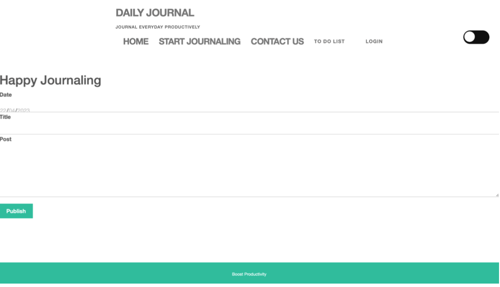
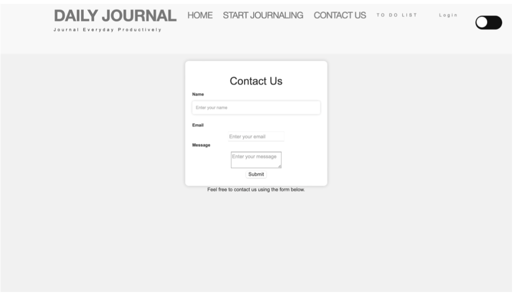
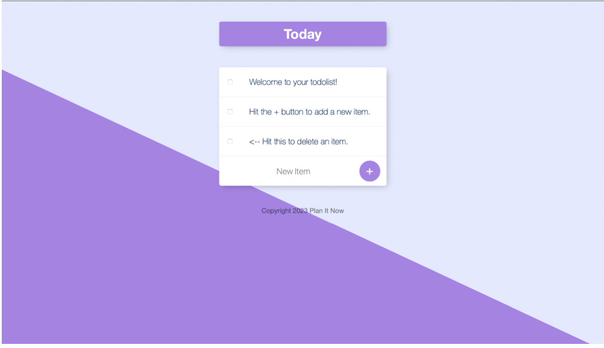
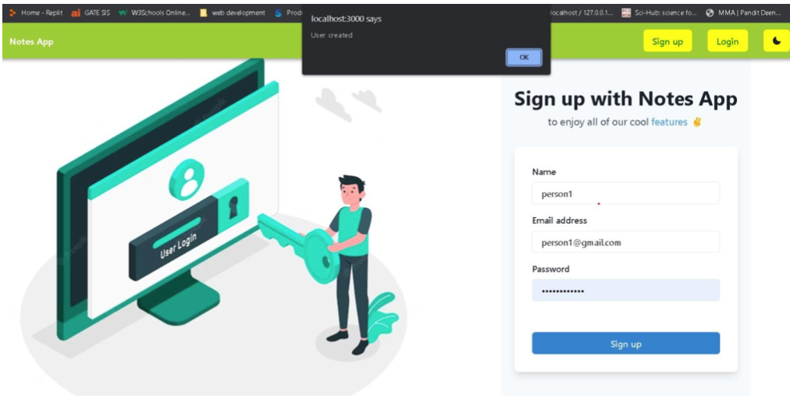

# PlanITNow: Your Ultimate Daily Journal and To-Do List Web Application

## Welcome to PlanITNow

PlanITNow is a feature-rich web application designed to streamline your daily organization and productivity. Built using cutting-edge MERN stack technologies, it offers a seamless experience for journaling and managing your to-do lists.

### Features at a Glance

- **Daily Journaling Made Easy**: Log your daily experiences, notes, and even attach photos or links effortlessly. The intuitive interface allows quick access to your past entries, enabling you to track your progress over time.

- **Efficient To-Do Lists**: PlanITNow includes a robust to-do list feature integrated into the daily journal UI. Easily jot down your tasks, check them off upon completion, and stay organized throughout your day.

- **Secure Data Storage**: Rest easy knowing that all your journal entries and to-do lists are securely stored in a MongoDB database. Our commitment to data security ensures the confidentiality of your personal information.

- **Fast and Reliable Performance**: The backend, powered by NodeJS and ExpressJS, guarantees swift and reliable performance, ensuring a seamless user experience.

- **Intuitive Frontend with React**: The frontend, developed with React, offers a user-friendly interface, making navigation and usage a breeze.

## Getting Started

1. **Sign Up and Create Your Account**: Get started by signing up and creating your PlanITNow account.

2. **Start Journaling and Planning**: Once logged in, begin your daily journaling and create your to-do lists effortlessly.

3. **Review and Edit**: Easily view, edit, or delete your past entries and tasks to keep your records up-to-date.

## Screenshots

## Contact Us

Thank you for choosing PlanITNow as your daily journal and to-do list companion. We value your experience, and your feedback is crucial to us. If you have any questions or suggestions, feel free to contact us. Happy organizing and stay productive with PlanITNow!

[Explore PlanITNow on GitHub](https://github.com/yourusername/PlanITNow)
